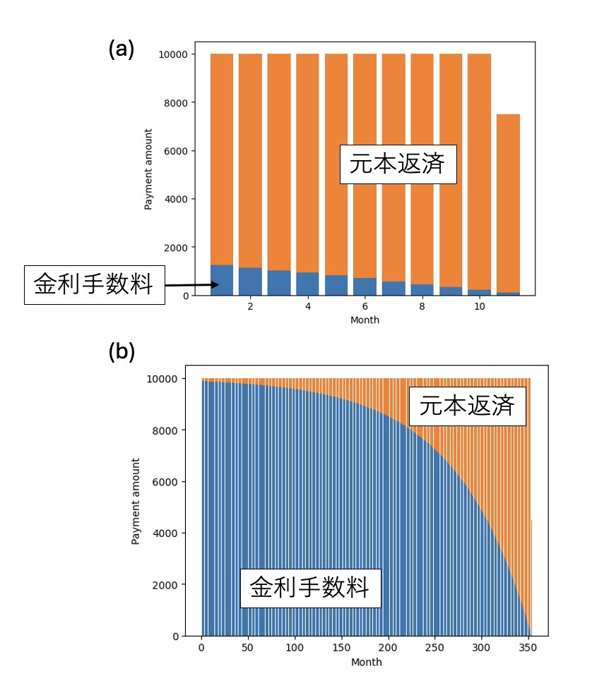
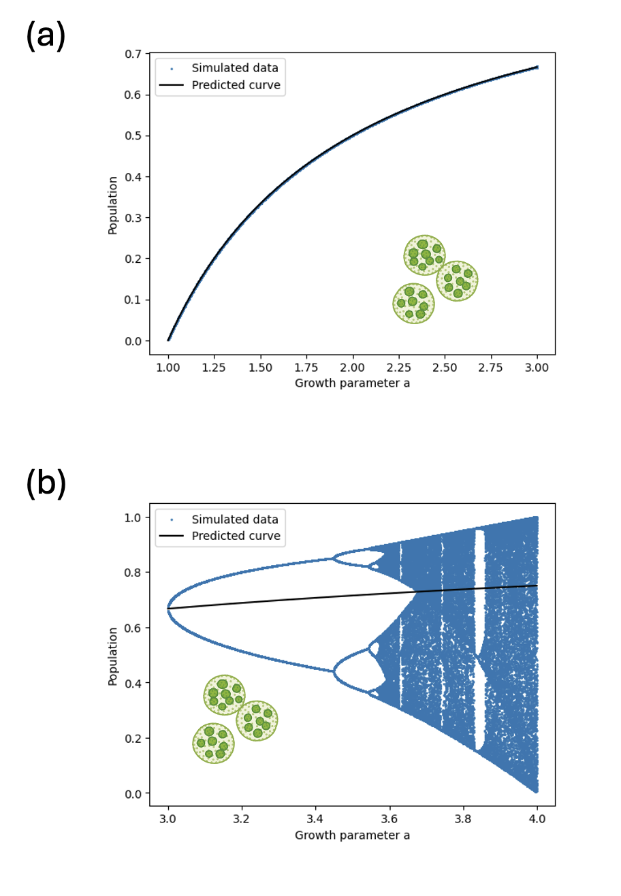

# リボ払いの恐怖　～簡単なルールが生み出す予測不可能な結果～

## はじめに

本書のテーマは、数値シミュレーションです。まず、シミュレーションとは何かを考えてみましょう。シミュレーションとは、ある決まったルールに従って動く世界を、実際に近い形で再現し、これから何が起こるかを予想することです。

身近な例として、飛行機のパイロットが訓練で使うフライトシミュレーターがあります。フライトシミュレーターには、実際の飛行機と同じような計器や操縦桿が用意されており、本物に近い感覚で操縦の練習ができます。これを使えば、悪天候での飛行やエンジントラブルのように、実際にはできるだけ経験したくない危険な状況も、安全な場所で再現できます。そして、そのような状況になったときにどう対応すればよいかを訓練することができます。

学校で行われる避難訓練も、シミュレーションの一種です。たとえば、「二階の化学準備室から火災が発生した」と想定し、各教室からグラウンドなどへ避難します。実際に火事が起きているわけではありませんが、火事が起きたと考えて行動することで、避難経路を確認したり、避難後に全員がそろっているかを確認したりする練習ができます。

このように、シミュレーションとは、実際にはまだ起きていないことを、あたかも起きているかのように再現し、そのとき何が起こるか、どのように行動すればよいかを調べる方法です。

では、数値シミュレーションとは何でしょうか。数値シミュレーションとは、コンピュータを使い、数式や数値計算によって現実の現象を再現したり、未来の変化を予測したりする方法です。

皆さんにとって身近な数値シミュレーションの例は、天気予報です。未来の天気を予測するためには、まず現在の天気の状態を知る必要があります。そのために、気象庁は各地の観測装置を使って、気圧、気温、風向、風速、降水量などを調べています。また、気象衛星から送られてくる雲の様子や海の状態などのデータも、重要な材料になります。現在の天気の状態がわかったら、次にコンピュータの中で地球の大気や海、陸地を細かいマス目に分けます。そして、それぞれのマス目に、観測によって得られた気温、海面水温、地面の温度、風の強さなどの値を入れていきます。こうして、コンピュータの中に「現在の地球の状態」を再現します。その後、空気の動き、水蒸気の変化、太陽から受ける熱などを、物理法則に従って計算していきます。すると、「数時間後に雲がどこへ動くか」「雨が降りやすい場所はどこか」「気温がどのように変化するか」といったことを予測できます。このようにして得られた計算結果に、現在の空の様子や過去の気象データなども合わせて考え、気象庁の予報官が最終的な天気予報を作ります。つまり、天気予報は、観測データ、人間の判断、そして数値シミュレーションを組み合わせて作られています。

数値シミュレーションは、自動車の開発でも重要な役割を果たしています。たとえば、自動車の安全性を確かめるためには、実際に車をぶつける衝突実験が欠かせません。しかし、実車を使った衝突実験には多くの費用と時間がかかるため、何度もくり返すことは簡単ではありません。そこで使われるようになったのが、衝突シミュレーションです。これは、コンピュータの中に仮想の自動車を再現し、その車をコンピュータ上で衝突させて、車体の変形や乗っている人への影響を調べる技術です。シミュレーションなら、衝突の角度や速度、部品の形や材料などの条件を少しずつ変えながら、何千回、何万回もの検討を行うことができます。その結果、実際の実験だけでは調べきれない多くの条件を比べられるようになりました。近年は、コンピュータの性能や車体を再現する技術が大きく進歩し、実車による衝突実験にかなり近い結果を出せるようになっています。そのため、自動車開発では、まずシミュレーションで多くの条件を調べ、その後、実車実験で結果を確認するという方法が広く使われています。

また、自動車の開発では、空気抵抗や走行中の騒音を小さくするために、車の周りを空気がどのように流れるかを調べる必要があります。このために使われる装置が風洞です。風洞は、車に風を当てて、走行中に近い状態を再現する実験装置です。風洞実験は信頼性の高い方法ですが、設備が大きく、実験にも費用と時間がかかります。そこで、空気の流れについても数値シミュレーションが使われるようになりました。コンピュータの中に仮想の風洞を作り、その中に車を置いて、空気の流れ方や抵抗の大きさを計算します。これにより、車体の形を少し変えたときに空気の流れがどう変わるかを、実際に模型や試作車を作る前に調べることができます。このように、衝突実験や風洞実験では、数値シミュレーションが高い精度で実験結果を再現できるようになってきました。ただし、実際の実験が不要になったわけではありません。現在の自動車開発では、シミュレーションで多くの案を調べ、最後に実験でその結果が正しいかを確認する、という使い分けが進んでいます。

## リボ払いのシミュレーション

数値シミュレーションは天気予報や自動車開発など、さまざまな場面で使われています。しかし、これらは専門的な現場で行われることが多く、皆さんが日常生活の中で直接使っていると感じる機会は少ないかもしれません。そこで、より身近な数値シミュレーションの例を考えてみましょう。その一つが、お金の返済に関するシミュレーションです。たとえば、家や車などの高い買い物をローンで購入するときには、「毎月いくら返すのか」「何年で返し終わるのか」「利息を含めると全部でいくら払うことになるのか」をあらかじめ計算します。これは、将来のお金の動きを数値で予測するシミュレーションです。

ここでは、借金の返済シミュレーションの例として、リボ払いを取り上げます。リボ払いは、毎月の支払額を一定にして返済していく支払い方法です。一見すると毎月の負担がわかりやすい方法ですが、利息のつき方によっては、返済がなかなか終わらないこともあります。そこで、数値シミュレーションを使って、リボ払いでは借金がどのように減っていくのかを調べてみましょう。

リボ払いにはいくつかの方式がありますが、以下では毎月の支払額を一定にする「元利定額方式」を、簡略化したモデルとして扱います。なお、実際のリボ払いでは、カード会社や契約内容によって手数料の計算方法や支払い方式が異なる場合があります。そのため、ここで扱う計算は、仕組みを理解するための単純化された例であることに注意してください。

元利定額方式とは、返済手数料を含めた毎月の支払金額が一定となる方式です。月々の支払い金額から借金残高に対応する金利手数料を除いた額だけ返済に充てられ、借金残高が減っていくことになります。この方式は借金残高とは無関係に毎月の支払額が固定されるため、資金運用計画が立てやすいというメリットがあります。

さて、金利を年率15%としましょう。毎月の支払額を1万円に固定して、10万円の借金をしたとします。年率15%ですから、10万円を1年間借りた時の利息は15000円となります。毎月の利息は日割り計算とすることが一般的ですが、ここでは簡単のために年率を12等分したものを月の利息としましょう。すると、15000円の12分の1である1250円が初月の金利手数料となります。支払額1万円のうち、1250円が金利手数料、残りの8750円が残高返済に充てられ、その文だけ借金残高が減ります。次の月は、借金残高が91250円となっているため、金利手数料が1140円、残高返済が8860円となります。このように、毎月の返済金額は同じ1万円ですが、借金残高が減るにつれて残高返済に充てられる金額が増えていき、借金が減る速さが早くなっていきます。最終的に、11回の支払い、総額10万7497円で借金の返済が完了します。この結果を見てどう思ったでしょうか？「あれ？思ったより安いな？」という感想だったかと思います。一般に「借金は複利で雪だるま式に増えていく怖いものだ」という認識があったかと思いますが、10万円を借りて11か月で10万7497円返すなら「たいしたことないな」と思うかもしれません。

同様に20万円を借りると24回払いで支払総額は23万1576円に、40万円借りても56回払いで55万7950円となります。さすがに40万借りて56万になるのは「ちょっと高くなったな」と思いますが、それでも年率15%で4年以上借りて、それで利息が40%程度なら「そんなものじゃないかな」と思うでしょう。

しかし、もう少し借りると様子が変わってきます。例えば70万円借りると168回払いで総額167万3673円と2倍以上に、79万円借りると353回払いで支払総額352万4484円と4倍以上に、そして80万円借りると、いくら支払っても借金残高は減らなくなり、一生お金を返し続けることになります。

図：10万円借りた場合と79万円借りた場合の返済シミュレーション。(a) 10万円借りた場合。(b) 79万円借りた場合。借入額が小さい場合は、毎月の支払いがほとんど元本返済に使われるが、借入額が大きくなると金利手数料の割合が大きくなる。

一体なにが起きたのでしょうか？　金利が年率15%、それを12か月で均等に割ると、毎月の金利手数料は借金残高の1.25%となります。80万円借りると、毎月の金利手数料は80万円の1.25%、すなわち1万円ぴったりになります。毎月の返済1万円は全て金利手数料となるため、借金の返済にあてられません。こうして、「毎月金利手数料を支払っているのに全く借金残高が減らない。でも毎月1万円なので気づかずに支払い続ける」という怖い状態が出来上がります。

もう一度ルールを見てみましょう。「金利が年率15%、毎月の金利手数料はそれを12等分、毎月の支払いは1万円固定」、これが今回設定したルールでした。このルールでは80万円借りたら借金が返済できなくなる、すなわち返済プランが破綻することがわかりました。金利手数料が支払い手数料を超えたら返済プランが破綻する、わかってしまえば当たり前ですが、これをシミュレーションする「前」に気づくことができたでしょうか？

このように「ルールは事前に完全にわかっているけれど、その結果は非自明」であることがよくあります。ルールが完全にわかっているのだから、どのような状態から始めたらどうなるかは完全に決まっています。しかし、「ルール」と「状態」からどうなるかをシミュレーションをすることなく予測することは困難です。数値シミュレーションでは、世界をプログラムによって記述しますが、プログラムが決まり、最初に与える値も決まっていれば、その後にコンピュータの中で何が起こるかは一つに決まります。つまり、同じプログラムに同じ値を入れれば、同じ結果が出るはずです。

しかし、プログラムを見ただけで、その結果がすぐにわかるとは限りません。たとえひとつひとつの命令は単純でも、それが何度もくり返されたり、途中の結果によって次の動きが変わったりすると、最終的にどうなるかを頭の中だけで予測するのは難しくなります。ここに、数値シミュレーションの面白さがあります。ルールはわかっている。最初の状態もわかっている。それなのに、その先にどのような結果が現れるかは、実際に計算を進めてみないとわからないことがあります。数値シミュレーションは、単に答えを出すための道具ではなく、単純なルールから思いがけない結果が生まれる様子を調べるための方法でもあります。

## シャーレの中のバクテリア

ルールは完全に決まっているのに、結果を想像するのが難しい例として、シャーレの中で増えるバクテリアの数を考えてみましょう。

シャーレの培地にバクテリアを入れます。このバクテリアは、一定時間ごとに子孫を残して死ぬとします。培地の栄養価が高いほど、1匹のバクテリアは多くの子孫を残すことができます。一方で、シャーレの広さや栄養には限りがあります。そのため、このシャーレの中で生きられるバクテリアの数には上限があると考えられます。このバクテリアの数の変化を、数式で表してみましょう。

$i$世代目のバクテリアの個体数を $N_i$ とします。また、このシャーレで生きられる個体数の最大値を $N_\mathrm{max}$ とします。

もし現在の個体数 $N_i$ が、最大値 $N_\mathrm{max}$ に比べて十分に少なければ、バクテリアは周囲の混雑を気にせずに増えることができます。このとき、1匹あたりおよそ $a$匹の子どもを残すとします。ここで$a$は培地の栄養価を表すパラメータで、栄養価が高いほど大きな値になります。

しかし、現在の個体数 $N_i$が$N_\mathrm{max}$に近づくと、シャーレの中が混み合い、栄養も足りなくなります。そのため、バクテリアはあまり子孫を残せなくなります。

このような状況を表す簡単なモデルとして、次の漸化式を考えます。

$$
N_{i+1} = a\left(1 - \frac{N_i}{N_\mathrm{max}} \right) N_i
$$

この式の意味を確認してみましょう。

現在の個体数 $N_i$ が $N_\mathrm{max}$ に比べて十分に小さいとき、

$$
\frac{N_i}{N_\mathrm{max}}
$$

はほとんど0です。したがって、

$$
1 - \frac{N_i}{N_\mathrm{max}} \simeq 1
$$

となり、次の世代の個体数は

$$
N_{i+1} \simeq aN_i
$$

となります。つまり、個体数はおよそ$a$倍に増えます。

一方、現在の個体数$N_i$が$N_\mathrm{max}$に近いとき、

$$
\frac{N_i}{N_\mathrm{max}} \simeq 1
$$

なので、

$$
1 - \frac{N_i}{N_\mathrm{max}} \simeq 0
$$

となります。そのため、次の世代の個体数$N_{i+1}$はほとんど0になります。個体数が多すぎると、次の世代に残せる子孫が大きく減ってしまう、ということを表しています。

この式を少し整理してみましょう。個体数$N_i$の代わりに、個体数の上限 $N_\mathrm{max}$に対する割合

$$
n_i = \frac{N_i}{N_\mathrm{max}}
$$

を考えます。

この$n_i$は、$i$世代目の個体数が上限に対してどれくらいの割合かを表します。たとえば、$n_i = 1$なら個体数は上限いっぱい、$n_i = 0.1$なら上限の10%という意味です。このように、量を基準となる値で割って扱いやすくすることを**規格化**といいます。規格化は、物理学でもよく使われる重要な考え方です。

先ほどの式の両辺を$N_\mathrm{max}$で割ると、

$$
n_{i+1} = a(1-n_i)n_i
$$

となります。だいぶ式がすっきりしました。

さて、この小さなシャーレの世界で、バクテリアが何世代も増え続けるとどうなるでしょうか。

まず、世代を重ねても個体数が変わらなくなる場合を考えます。このような状態を定常状態と呼びます。定常状態では、次の世代になっても個体数の割合が変わらないので、

$$
n_i = n_{i+1} = n
$$

となります。これを先程の漸化式に代入すると、

$$
n = a(1-n)n
$$

となります。

この式を解くと、定常状態の候補として

$$
n = 0
$$

と

$$
n = 1 - \frac{1}{a}
$$

の2つが得られます。$n=0$は、バクテリアが全滅している状態を表します。もう一つの$n=1-1/a$は、バクテリアがある割合で生き残り続ける状態を表しています。

この式を見ると、栄養価を表すパラメータ$a$が大きいほど、個体数割合$n$は1に近づくことがわかります。つまり、栄養価が高いほど、個体数は上限に近い値で落ち着くと考えられます。一方、$a$が1に近づくと、$1-1/a$は$0$に近づきます。特に $a=1$ のとき、この値は0になるため、バクテリアは全滅すると考えられます。

ただし、ここで注意したいのは、この計算で求めた値はあくまで「定常状態の候補」だということです。実際に世代を重ねたときにその値に落ち着くかどうかは、成長パラメータ$a$の値によって変わります。そこで、シミュレーションで確かめてみましょう。初期値を$n=0.1$として、さまざまな$a$の値について1000世代分の計算を行い、最後の100世代の値をプロットしています。最初の方の値を捨てているのは、十分に時間が経った後に個体数がどのような振る舞いをするかを見るためです。

シミュレーションした結果は以下の図のようになります。

図：バクテリアの最後の100世代の

成長パラメータが$1\le a \le 3$の場合は、定常状態の予測値$1-1/a$とシミュレーションの結果が完全に一致します。これは、それぞれの$a$の値に対して、最後の100世代の点がほとんど1つの値に重なっていること、つまり世代を重ねると個体数が一定の値に落ち着くことを意味します。また、その落ち着く値は、先ほど求めた$n = 1 - 1/a$と一致します。つまり、この範囲では、シミュレーションの結果は定常状態の計算とよく合っています。ここまでは、直感どおりの結果だと言えるでしょう。

しかし、成長パラメータ$a$の値が3を超えると不思議な図が現れます。たとえば$a=3.2$のあたりを見ると、点が1つの値には集まっていません。代わりに、$n$が約0.5付近と約0.8付近の2つの値を行き来しています。これは、個体数が一定値に落ち着くのではなく、世代ごとに2つの値の間を振動していることを表しています。

さらに$a$を大きくしていくと、振動する値は2個から4個、4個から8個へと増えていきます。そして、ある範囲では、個体数が非常に複雑に変化するようになります。

ここで重要なのは、もとのルールは

$$
n_{i+1} = a(1-n_i)n_i
$$

というとても単純な式だったということです。それにもかかわらず、成長パラメータ$a$を変えるだけで、定常状態、周期的な振動、そして複雑な変化が現れます。

今回扱った漸化式は**ロジスティック写像**と呼ばれ、生物の個体数が環境による上限をもつために無限に増えることができないことを表すために使われてきた式です。

この式を有名にした研究者の一人が、生物学者のロバート・メイです。メイは1976年に発表した論文で、非常に単純な式でもパラメータによっては驚くほど複雑な振る舞いを示すことを指摘しました。

この発見が重要だったのは、それまで「複雑な変化には、複雑な原因があるはずだ」と考えられがちだった世界に「単純なルールが複雑な結果を生む可能性がある」という考えを持ち込んだことです。たとえば、ある生物の個体数が毎年ばらばらに変化していると、天候、病気、捕食者、食料不足など、たくさんの外部要因が複雑に関係しているように見えます。しかしロバート・メイの研究は、そうとは限らないことを示しました。たった一つの簡単な式で決まっている場合でも、個体数が一定値に落ち着いたり、2つの値を交互に行き来したり、さらに複雑で一見ランダムな変化をしたりすることがあります。

このような現象は、現在では**カオス**と呼ばれています。カオスとは、もともとは混沌という意味を持つ単語ですが、科学でいうカオスは、単なるでたらめとは少し違います。カオスを引き起こす世界では、次に何が起きるかを決めるルールはきちんと存在しています。ロジスティック写像の場合も、$a$の値と最初の個体数割合を決めたら、後の世代の個体数は完全に決まります。サイコロを振るような偶然が入っているわけではありません。

それにもかかわらず、成長パラメータ$a$の値によっては、個体数の変化が非常に複雑になり、長い時間の後にどのような値になるかを予測することが難しくなります。特に、最初の値がほんの少し違うだけで、しばらく後にはまったく異なる結果になることがあります。科学でいうカオスとは、このように「決まったルールに従っているにもかかわらず、未来の予測がとても難しくなる現象」のことです。ロジスティック写像は、このカオスをとても単純な式から見ることができる代表的な例です。

## まとめ

この章では、数値シミュレーションとは何かを、身近な例から考えてきました。シミュレーションとは、現実の世界で起こることを、ある決まったルールに従って再現する方法です。そして数値シミュレーションとは、現実の現象や仕組みをルールとして表し、そのルールに従って計算をくり返すことで、未来の変化や全体の結果を予測する方法です。借金の返済や、バクテリアの数のシミュレーションを通じて、「単純なルールなのに思いがけない結果が現れる」ことがわかりました。数値シミュレーションの面白さはそこにあります。「世界」を記述するルールが完全にわかっており、最初の状態も分かっている、したがって今後どうなるかは完全に決まっているのに、その結果を予想することは難しく、何が起きるかは実際に計算してみないとわかりません。

数値シミュレーションは、単に答えを出すための道具ではありません。単純なルールの裏に隠れている意外な結果をあぶり出すためのツールです。予想もしなかった計算結果を見て、その理由を考え、解釈することで、我々は少しだけ賢くなることができます。数値シミュレーションは、単に未来を予測するためのツールではなく、私たちが問題を理解し、賢くなるためのツールでもあるのです。
