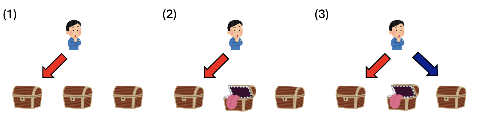

# 直感はなぜ外れる？

前章では、ルールと最初の状態を決めると、その後に起きることが一つに決まる数値シミュレーションを取り上げました。たとえば、借金の返済シミュレーションでは、借りた金額、金利、毎月の支払額を決めれば、その後の借金残高の変化は計算によって決まります。同じ条件で計算すれば、何度シミュレーションしても同じ結果になります。このように、同じ条件から始めれば必ず同じ結果になる問題を、決定論的な問題と呼びます。

しかし、世の中には、同じ条件から始めても毎回同じ結果になるとは限らない問題もたくさんあります。たとえば、すごろくではサイコロを振って進むマスの数を決めます。同じ場所からスタートしても、次に1が出るか、6が出るかは事前にはわかりません。そのため、同じようにゲームを進めても、毎回違った結果になることがあります。ゲームの中にも、このような例はたくさんあります。RPGで「かいしんのいちげき」が出るかどうか、ソーシャルゲームでレアなアイテムが手に入るかどうか、カードゲームで次にどのカードを引くかなどは、すべて確率に左右されます。ルールは決まっていますが、その場で何が起こるかは、確率によって変わるのです。このように、結果に偶然の要素が含まれる問題を、確率的な問題と呼びます。

確率的な問題では、「必ずこうなる」と一つの結果を予測することはできません。その代わりに、「どの結果がどれくらい起こりやすいか」を考えます。たとえば、サイコロを1回振ったとき、次に出る目を正確に当てることはできません。しかし、何度も振れば、それぞれの目がだいたい同じくらいの割合で出るだろう、と予想することはできます。ここでも、シミュレーションが役に立ちます。コンピュータでサイコロを何千回、何万回も振ったことにして、その結果を調べれば、偶然を含む問題でも全体としてどのような傾向があるのかを見ることができます。このとき使うのが乱数です。乱数とは、サイコロの目のように、毎回異なる値が出るように作られた数のことです。乱数を使うことで、コンピュータの中で「偶然」を再現できます。

さて、確率の問題は、しばしば私たちの直感に反する結果をもたらします。「どちらを選んでも同じに見える」のに、実は片方を選んだ方が明らかに有利な場合があります。反対に、「こちらの方が得に見える」と思っても、よく調べるとそうではない場合もあります。

本章では、そのような確率の不思議を、乱数を用いたシミュレーションによって調べてみましょう。

## モンティ・ホール問題

以下のようなルールのゲームを考えてみましょう。ゲームの挑戦者の前には、三つの箱があります。そのうち一つがアタリで、残り二つはハズレです。アタリの箱を選ぶことができれば、挑戦者は景品をもらえます。まず、司会者は挑戦者に、三つの箱の中から一つを選ぶように言います。挑戦者が一つの箱を選ぶと、司会者は、挑戦者に見えないように残り二つの箱の中身を確認します。そして、その中からハズレの箱を一つ開けます。ここで、司会者は挑戦者にこう言います。

「最初に選んだ箱のままでもよいですし、まだ開けられていないもう一つの箱に選び直してもかまいません」

挑戦者は、「最初の選択を変えない」か、「残っている箱に選び直す」かを決めます。その後、最終的に選んだ箱を開け、アタリかハズレかを確認します。さて、このとき、あなたなら最初に選んだ箱を変更するべきでしょうか。それとも、変更してもしなくても、景品が当たる確率は変わらないでしょうか。


モンティ・ホール問題。三つの箱のうち、当たりの箱は一つだけ。(1) 挑戦者は最初に一つ箱を選ぶ。(2) 司会者は選ばれなかった二つの箱のうち、ハズレの箱を開ける。(3) 挑戦者は、残ったもう一つの箱を選び直すチャンスが与えられる。

この問題は、モンティ・ホール問題と呼ばれています。もともとはアメリカのテレビ番組に由来する問題で、その後、雑誌のコラムで取り上げられました。そして、多くの専門家や読者が答えを間違えたことで、大きな話題になりました。有名な問題なので、答えを知っている人もいるかもしれません。しかし、なぜその答えが正しいのかを、きちんと説明できるでしょうか。

この問題は、確率の問題です。確率の問題には、答えを出したあとに「本当にこれで合っているのか」を確かめにくいという特徴があります。たとえば、方程式の問題であれば、求めた答えを元の式に代入することで、正しいかどうかを確認できます。漸化式の一般項を求める問題でも、最初の数項を計算してみれば、少なくとも明らかな間違いには気づくことができます。最初のいくつかの値が合っていれば、答えが正しそうだと判断する手がかりになります。

一方で、確率の問題ではどうでしょうか。答えが出ても、それをどこかに代入して簡単に確認できるとは限りません。解説を読んでその場では納得したつもりでも、どこかだまされたような気がして、すっきりしないこともあります。そのようなときに役立つのがシミュレーションです。確率の問題では、同じ実験を何度もくり返して、どの結果がどれくらいの割合で起こるかを調べることで、正しい答えを推定できます。そこで、数学的に詳しく考える前に、まずはモンティ・ホール問題をシミュレーションしてみましょう。

シミュレーションの手順を考えます。まず、三つの箱を用意し、それぞれに1、2、3という番号をつけます。ゲームが始まるときに、アタリの箱をランダムに一つ決めます。次に、挑戦者も最初に選ぶ箱をランダムに一つ決めます。その後、司会者は、挑戦者が選ばなかった箱のうち、ハズレの箱を一つ開けます。この時点で、挑戦者には二つの選択肢があります。一つは、最初に選んだ箱をそのまま選び続けることです。もう一つは、まだ開けられていない残りの箱に選び直すことです。ここでは、常に最初の選択を変えない挑戦者を「キープ派」、常に残りの箱に選び直す挑戦者を「チェンジ派」と呼ぶことにします。キープ派とチェンジ派に同じゲームを何度もくり返しプレイさせれば、どちらの方が景品を当てる確率が高いのかを調べることができます。

さて、キープ派のプログラムは簡単です。選択を変えないのですから、最初に選んだ箱がアタリならアタリ、そうでなければハズレとなります。

```py
from random import choice
games = 10000
wins = 0
for _ in range(games):
    boxes = [1,2,3] # 三つの箱を用意する
    answer = choice(boxes) # 正解の箱を決める
    first_choice = choice(boxes) # 最初の箱を選ぶ
    # 正解と一致していたらアタリ
    if first_choice == answer:
        wins = wins + 1
print(wins/games)
```

図1：キープ派の景品獲得確率計算コード

このコードを実行すると、結果は毎回少しずつ変わりますが、たとえば 0.3286 や 0.3277 といった数値が表示されます。これを見ると、「およそ1/3なのだろう」と予想できます。考えてみれば、キープ派の場合、最初に選んだ箱がアタリならそのままアタリになり、最初に選んだ箱がハズレならそのままハズレになります。つまり、最初にアタリの箱を選べるかどうかだけで結果が決まります。三つの箱のうちアタリは一つだけなので、キープ派が景品を当てる確率は 1/3 になるはずです。

一方、チェンジ派の場合は少し複雑です。司会者は、挑戦者が箱を一つ選んだあと、残り二つの箱の中身を、挑戦者に見えないように確認します。そして、その中から必ずハズレの箱を一つ開けます。もし挑戦者が最初にアタリの箱を選んでいた場合、残り二つの箱はどちらもハズレです。そのため、司会者はどちらの箱を開けてもよく、ランダムに一つを選んで開けることになります。一方、挑戦者が最初にハズレの箱を選んでいた場合、残り二つの箱のうち一つはアタリ、もう一つはハズレです。このとき司会者は、アタリの箱を開けてはいけないので、必ずハズレの箱を開けます。すると、開けられずに残った箱はアタリになります。チェンジ派は、司会者が箱を一つ開けたあと、最初に選んだ箱をやめて、まだ開けられていないもう一つの箱を選びます。つまり、チェンジ派は「司会者が開けなかった方の箱」に選び直すことになります。

この手順をそのままコードにすると、図2のようになります。

```py
from random import choice
games = 10000
wins = 0
for _ in range(games):
    boxes = [1,2,3] # 三つの箱を用意する
    answer = choice(boxes) # 正解の箱を決める
    first_choice = choice(boxes) # 最初の箱を選ぶ
    # 最初に選んだ箱がアタリかどうか
    if first_choice == answer: 
        # アタリなら、残りの二つからランダムに選ぶ
        boxes.remove(answer)
        second_choice = choice(boxes)
    else:
        # ハズレなら、残りは必ず正解
        second_choice = answer
    if second_choice == answer:
        wins = wins + 1
print(wins/games)
```

図2: チェンジ派の景品獲得確率計算コード

これを実行すると、0.6694や0.6671といった数字が出力されます。結果は毎回少しずつ変わりますが、どれも2/3に近い値になっています。したがって、チェンジ派が景品を当てる確率は、およそ2/3なのだろうと予想できます。この予想を持ったうえでコードを見直すと、「最初に選んだ箱がハズレなら、残った箱はアタリになる」という部分に気づきます。

チェンジ派について、場合を分けて考えてみましょう。もし最初にアタリの箱を選んでいた場合、司会者がハズレの箱を一つ開けたあと、チェンジ派は残ったもう一つの箱に選び直します。しかし、この場合、最初に選んだ箱がアタリだったので、選び直した先はハズレになります。

一方、最初にハズレの箱を選んでいた場合、残り二つの箱のうち、一つはアタリで、もう一つはハズレです。司会者はそのうちハズレの箱を開けるので、開けられずに残った箱は必ずアタリになります。チェンジ派はその箱に選び直すため、景品を当てることができます。

つまり、チェンジ派は「最初に選んだ箱がハズレなら当たり、最初に選んだ箱がアタリなら外れる」ことになります。三つの箱のうちハズレは二つあるので、最初にハズレの箱を選ぶ確率は2/3です。したがって、チェンジ派が景品を当てる確率は2/3になります。

また、キープ派とチェンジ派の関係を考えると、別の見方もできます。同じゲームで、キープ派は最初に選んだ箱をそのまま選び続けます。一方、チェンジ派は、司会者がハズレの箱を開けたあと、残ったもう一つの箱に選び直します。このとき、キープ派とチェンジ派のどちらか一方は必ず当たり、もう一方は必ず外れます。最初に選んだ箱がアタリならキープ派が当たり、チェンジ派は外れます。最初に選んだ箱がハズレならキープ派は外れ、チェンジ派が当たります。キープ派が当たる確率は1/3でした。したがって、チェンジ派が当たる確率は、残りの2/3になるはずです。

このように、シミュレーションの結果を見ると、そのあとで「なぜそうなるのか」という理屈が見えてくることがあります。この点は、前に見たリボ払いの例と同じです。ルールは最初からわかっていても、結果をすぐに予想できるとは限りません。しかし、実際にシミュレーションしてみることで結果の傾向が見え、その結果を手がかりにして仕組みを理解することができます。

## 誕生日のパラドックス

次に、もう一つ有名な確率の問題を見てみましょう。誕生日のパラドックスと呼ばれる問題です。なお、ここでいう「パラドックス」とは、本当に矛盾しているという意味ではありません。計算は正しく、特に矛盾はしていないのですが、私たちの直感とは違う結果になるため、不思議に感じられる問題という意味です。

あるクラスに何人かの生徒がいる時、その中に「同じ誕生日の二人」がいる確率を考えます。ただし、ここでは簡単のために、1年は365日で、うるう年は考えないことにします。また、どの日に生まれる確率も同じであると仮定します。たとえば、クラスに2人しかいなければ、二人の誕生日が一致する確率はかなり低そうです。しかし、クラスが10人、20人と増えていくと同じ誕生日を持つ二人がいる確率が増えていきそうです。では、クラスに何人いれば同じ誕生日の人が50%を超えるでしょうか？

多くの人は「一年は365日あるから、同じ誕生日の人が出る確率が50%となるのは、その半分くらいの180人くらいかな」と考えがちです。しかし、実際にはもっと少ない人数で50%を超えます。シミュレーションしてみましょう。

図3に、クラスの人数と「同じ誕生日の人がいる確率」を計算するコードを示します。N人のクラスをランダムに100回作り、そのうち何回で「クラスに同じ誕生日の二人」がいるかを計算します。それを人数を変えながら増やしていくプログラムです。


このプログラムを実行すると、人数が少ないうちは、同じ誕生日の人がいる確率は低いことがわかります。しかし、人数が増えるにつれて、その確率は急に大きくなっていきます。特に注目すべきなのは、23人前後で確率が50%を超えることです。つまり、23人のクラスがあれば、その中に同じ誕生日の二人がいる確率は、いない確率よりも少し高くなるのです。これは、直感とはかなり違う結果ではないでしょうか。365日もあるのに、たった23人で50%を超えるというのは、不思議に感じられるかもしれません。

では、なぜこのような結果になるのでしょうか。ここで注意したいのは、この問題が「自分と同じ誕生日の人がいる確率」を考えているのではないという点です。誕生日のパラドックスで考えているのは、「クラスの中の誰か二人の誕生日が一致する確率」です。つまり、自分と他の人だけではなく、クラス全員どうしの組み合わせを考える必要があります。たとえば、23人の中から二人を選ぶ組み合わせは全部で253通りあります。23人しかいなくても、「二人の組」は意外に多く作れるのです。そのため、その253通りのどこかで誕生日が一致する可能性は、私たちが直感的に考えるよりも高くなります。

では、数学的に「クラスに同じ誕生日の二人が存在する確率」をちゃんと計算してみましょう。数学的には、「同じ誕生日の二人がいる確率」を直接求めるよりも、「全員の誕生日がすべて異なる確率」を考える方が簡単です。1人目の誕生日は、どの日でも構いません。したがって、1人目については確率を気にする必要はありません。2人目が1人目と違う誕生日である確率は、365日のうち364日なので、364/365です。3人目が前の2人と違う誕生日である確率は、365日のうち363日なので、363/365です。同じように考えていくと、23人全員の誕生日がすべて異なる確率は、

$$
365/365 \times 364/365 \times 363/365 \times \cdots \times 343/365 = 
\prod_{k=0}^{22} \frac{365-k}{365}
$$

となります。この値を計算すると、およそ0.493になります。これは、「23人全員の誕生日がすべて異なる確率」です。したがって、「少なくとも二人の誕生日が一致する確率」は、1からこの値を引いた値、すなわち0.507となります。つまり、23人の中に同じ誕生日の二人がいる確率は、約50.7%になります。シミュレーションで得られた結果と、ほぼ同じ値になりました。

## まとめ

本章では、確率的な問題と、それを調べるための乱数を用いたシミュレーションについて見てきました。前章で扱ったリボ払いのシミュレーションでは、最初の条件と計算ルールを決めれば、その後の結果は一つに決まりました。このような問題を決定論的な問題と呼びます。一方、本章で扱った問題では、サイコロの目や誕生日のように、偶然によって結果が変わる要素が含まれていました。このような問題を確率的な問題と呼びます。

確率の問題はしばしば直感に反する結果になることがあります。モンティ・ホール問題では「箱の選択を変えても変えなくても同じ」になりそうですが、実際にはアタリを選ぶ確率は2倍も違いました。誕生日のパラドックスでは、想像よりも少ない人数で「誕生日のかぶり」が発生しました。

この時、コンピュータの中でサイコロを振る、乱数シミュレーションと呼ばれる手法を使うことで、何度も試して確率を見積もることができます。そして、その結果を見て、「こうなりそうだな」と見通しを得てから考えると、数学的に正しい答えに行き着きやすくなります。このように、数値シミュレーションは直感ではわかりにくい確率の問題を理解するのにも強力な道具なのです。
