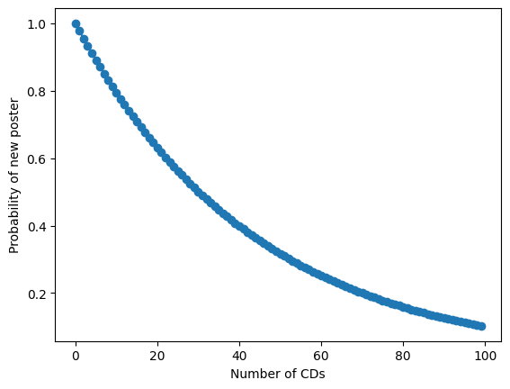

# ガチャの沼へようこそ　～当たりそうで当たらない確率の罠～

## はじめに

「ガチャ」という言葉を聞いたことがあるでしょう。もともとは、「カプセルトイ」と呼ばれる小型の自動販売機から来た言葉です。カプセルトイは、硬貨を入れてレバーを回すと、カプセルに入ったおもちゃなどが出てくる仕組みになっています。レバーを回すときに「ガチャガチャ」と音が鳴ることから、「ガチャ」や「ガチャガチャ」と呼ばれるようになりました。なお、バンダイは「ガシャポン」や「ガチャガチャ」という名前を商標登録しています。

カプセルトイの面白さは、お金を入れてカプセルが出てくるまで、中に何が入っているかわからないところにあります。さらに、たまに「シークレット」と呼ばれる、一覧には載っていない特別な種類が入っていることもあります。そのため、「次こそ欲しいものが出るかもしれない」と思って、つい何度も挑戦したくなります。

やがて、このような仕組みはソーシャルゲーム、いわゆるソシャゲにも広がりました。ソシャゲでは、お金を払うと、キャラクターやアイテムがランダムに手に入ることがあります。この仕組みも「ガチャ」と呼ばれています。

ガチャで手に入るキャラクターやアイテムには、「ノーマル」「レア」「スーパーレア」「ウルトラレア」などのように、手に入りやすさを表す「レア度」が設定されています。レア度が高いものほど手に入りにくく、多くの人がそれを目当てにガチャを引きます。その結果、欲しいキャラクターやアイテムが出るまで何度も課金してしまう、いわゆる「廃課金」が問題になることもあります。

多くの場合、レアアイテムやレアキャラクターが出る確率は公開されています。しかし、実際にガチャを引いてみると、「確率は◯％のはずなのに、なかなか当たらない」と感じることがあります。「物欲センサー」という言葉を聞いたことがあるかもしれません。これはゲームなどでランダムに出現するようなアイテムが「不要な時にはちょくちょく出てくるのに、欲しい時に限って極端に出なくなる」現象を指します。まるでゲームがプレイヤーの物欲を検出してアイテム出現確率を「渋く」しているかのように見えるのでそう呼ばれるようになりました。この「物欲センサー」は本当にあるのでしょうか？

以下では、このようなガチャの仕組みについて、シミュレーションを使って調べてみましょう。

## ガチャでレアが外れ続ける「運が悪い」人

ガチャを一度回すと、あるアイテムが出る確率が1%だったとしましょう。運が良い人はいきなり最初に当ててしまう人もいるでしょう。運が悪い人は100回回しても当たらないかもしれません。でも、1%という確率なら、なんとなく100回回せば当たりそうな気がします。逆に、100回も回して一度も当たらなかったら、かなり運が悪い気がしますね。

では、100分の1の確率で当たるガチャを100回引いてあたらない「運が悪い人」はどのくらいいるのでしょうか？100分の1で当たるガチャを100回引く人が1万人いた時、一度も当たらない「運が悪い人」が何人いるか、シミュレーションで調べてみると、1万人中3638人いることがわかります。割合にすると36.4%です。つまり、およそ3人に1人は一度も当たらないことになります。「100回に1回くらい当たるガチャを100回引けば、さすがに1回くらいは当たるだろう」と思っていた人もいるかもしれません。しかし、実際にはかなり多くの人が一度も当たらないのです。

コードを少し修正して、「1000回に1回くらい当たるガチャを、1000回引く」というシミュレーションをしてみましょう。実行すると、1000回引いて一度も当たらなかった人が、1万人中3646人になります。先ほどと比べても、割合はあまり変わっていません。

このように、$n$の値を変えて何度かシミュレーションしてみると、$1/n$の確率で当たるガチャを$n$回引いたとき、一度も当たらない人の割合は、ある一定の値に近づいていくことがわかります。その値はだいたい36.8%です。この数字には、どのような意味があるのでしょうか。少し数学的に考えてみましょう。

$1/n$の確率で当たるガチャでは、1回引いて外れる確率は

$$
1-\frac{1}{n}
$$

です。したがって、$n$回連続で外れる確率$P_n$ は、

$$
P_n = \left(1 - \frac{1}{n} \right)^n
$$

と表せます。

ここで、$n$をどんどん大きくしたときに、この値がどこに近づくかを考えます。ネイピア数 $e$は、次の式で定義される数です。

$$
e = \lim_{n \to \infty} \left(1 + \frac{1}{n} \right)^n
$$

この定義を使うと、

$$
\lim_{n \to \infty} P_n
=
\lim_{n \to \infty} \left(1 - \frac{1}{n} \right)^n
=
\frac{1}{e}
$$

となります。

$$
\frac{1}{e} \approx 0.368
$$

なので、$n$が大きくなると、一度も当たらない確率は約36.8%に近づきます。

数学の授業でネイピア数$e$の定義を見たとき、「これは何に使うのだろう」と思った人もいるかもしれません。実は、$e$はこのように確率の問題にも現れます。このように、確率の問題では、私たちの直感とは少し違う結果が出ることがあります。また、一見関係なさそうに見える数学の概念が、身近な問題の中に現れるところも面白いところです。

## アイドルのイベント

先ほどは、ガチャが連続で外れる確率が思ったより大きいことを見ました。次に、ガチャで指定のカードをすべて揃えると特典がもらえる、いわゆる「コンプガチャ」について考えてみましょう。

あるアイドルが、新曲のリリースを記念してイベントを行ったとします。そのシングルCDを購入すると、特典としてポスターが1枚もらえます。ポスターは全部で44種類あり、どのポスターがもらえるかはランダムです。そして、「44種類すべてのポスターをコンプリートした人を、特別なイベントに招待します」という企画だったとしましょう。

最初にCDを1枚購入したときは、まだポスターを1枚も持っていないので、必ず新しい種類のポスターが手に入ります。では、2枚目のCDを購入したときはどうでしょうか。1枚目と同じポスターが出てしまう確率は、44分の1です。

手元にあるポスターの種類が増えるほど、次にもらえるポスターがすでに持っているものと「かぶる」確率は高くなっていきます。たとえば、いま手元に22種類のポスターを持っているなら、次にCDを買ったときに、すでに持っているポスターが出る確率は44分の22、つまり50%です。

では、44種類すべてのポスターをコンプリートするには、平均で何枚のCDを購入する必要があるでしょうか。

答えを読む前に、まず自分で予想してみてください。44種類だから、50枚くらいでしょうか。それとも100枚くらいでしょうか。あるいは、もっと必要なのでしょうか。予想できましたか？では、次に進みましょう。

この問題には、実は厳密な答えを求める方法があります。しかし、いきなり式で考えるよりも、まずはシミュレーションしてみるとイメージしやすくなります。

たとえば、1から44までの数字を紙に書いておきます。そして、44個の目があるサイコロを用意したと考えます。サイコロを振って、出た目の数字を紙から消していきます。すでに消えている数字が出た場合は、「同じポスターが出た」と考えます。

この作業を続けて、44個すべての数字が消えたとき、つまり44種類すべてのポスターが揃ったときに、サイコロを何回振ったかを記録します。これが、「コンプリートまでにCDを何枚買ったか」に対応します。シミュレーションコードを実行してみると、毎回結果は少しずつ変わりますが、およそ190〜193枚くらいの値になります。

さて、この「ポスターコンプリート問題」は、シミュレーションだけでなく、期待値を使って厳密に計算することもできます。

ポスターが全部で44種類あるとします。いま、すでに$n$種類のポスターを持っているときに、まだ持っていない新しいポスターを1種類手に入れるまでに必要なCDの枚数の期待値を$C(n)$とします。

最初はまだ1枚もポスターを持っていないので、$n=0$です。このときは、CDを1枚買えば必ず新しいポスターが手に入ります。したがって、

$$
C(0)=1
$$

となります。

次に、すでに1種類のポスターを持っている場合を考えます。このとき、次にCDを買って同じポスターが出てしまう確率は

$$
\frac{1}{44}
$$

です。つまり、新しいポスターが出る確率は

$$
\frac{43}{44}
$$

です。

確率が$\frac{43}{44}$で成功する試行では、成功するまでに必要な回数の期待値は、その逆数になります。したがって、

$$
C(1)=\frac{1}{43/44}=\frac{44}{43}
$$

となります。

同じように考えると、すでに$n$種類のポスターを持っているとき、まだ持っていないポスターは$44-n$種類あります。したがって、新しいポスターが出る確率は

$$
\frac{44-n}{44}
$$

です。

よって、新しいポスターを1種類増やすために必要なCD枚数の期待値は、その逆数なので、

$$
C(n)=\frac{44}{44-n}
$$

となります。

あとは、ポスターを0種類持っている状態から、43種類持っている状態までを順番に考えればよいです。つまり、

$$
C(0)+C(1)+C(2)+\cdots+C(43)
$$

を計算します。

これは、

$$
\frac{44}{44}+\frac{44}{43}+\frac{44}{42}+\cdots+\frac{44}{1}
$$

という和になります。

この値を計算すると、

$$
44\left(\frac{1}{44}+\frac{1}{43}+\cdots+\frac{1}{1}\right)
$$

となり、約192.4になります。つまり、44種類のポスターをすべて集めるには、平均すると約192.4枚のCDを買う必要がある、ということです。シミュレーションで190〜193枚くらいの値が出るのは、この厳密な期待値に近い結果になっているからです。

さて、この約192枚という数字は、先ほどの予想と比べてどうだったでしょうか。「思ったより少ないな」と感じた人も多いかもしれません。もしかすると、全部そろえるには1000枚や2000枚くらい必要になるような、もっとひどい仕組みを想像していた人もいるでしょう。

しかし、実はギャンブルやランダム商品では、「プレイヤーがハマる」ために、ある程度は「ほどよく当たる」ことが重要です。たとえば、パチンコ屋に入ったとき、誰一人として大当たりを引いていなかったらどう感じるでしょうか。多くの人は、「これは当たらなさそうだ」と思って、すぐに諦めてしまうかもしれません。

逆に、ホールを見渡したときに、どこかで誰かが大当たりを引いていると、「自分にも当たるかもしれない」と感じやすくなります。さらに、自分が台の前に座ってしばらくしたあと、隣の人が大当たりを引いたら、「自分もそろそろ当たるかも」と思って、やめるタイミングを見失ってしまうこともあります。このように、ギャンブルでは「まわりに当たっている人がほどよく存在すること」がとても重要です。

ギャンブルには、もう一つ重要な心理があります。それは、「ここで諦めたら、これまで使ったお金が無駄になってしまう」という気持ちです。

このような心理がどのように生まれるのかを考えるために、「CDを$n$枚購入している状態で、もう1枚CDを購入したとき、新しいポスターを手に入れる確率」を計算してみましょう。

まず、ある特定の1種類のポスターに注目します。1枚CDを買ったとき、そのポスターが出ない確率は44分の43です。では、$n$枚CDを購入しても、そのポスターをまだ引けていない確率を$P_1$とすると、

$$
P_1=\left(\frac{43}{44}\right)^n
$$

となります。

ポスターは全部で44種類あります。したがって、$n$枚のCDを購入した時点で、まだ手に入れていないポスターの種類数の期待値は、この値を44倍したものになります。

つまり、

$$
44P_1
$$

です。

この状態で、さらにCDを1枚購入すると、44種類のポスターのうちどれか1種類が手に入ります。

まだ手に入れていないポスターの種類数の期待値は$44P_1$なので、新しいポスターを手に入れる確率は

$$
\frac{44P_1}{44}
$$

です。これは、$P_1$に等しいです。

したがって、CDを$n$枚購入したあと、次の1枚で新しいポスターを手に入れる確率は

$$
\left(\frac{43}{44}\right)^n
$$

となります。つまり、新しいポスターを手に入れる確率は、CDの購入枚数$n$が増えるにつれて、指数関数的に減少していくことになります。ここで大事なのは、「新しいポスターを手に入れる確率」は、最初のうちはかなり高いということです。まだ手元にあるポスターの種類が少ないときは、同じポスターがかぶる確率が低いので、どんどん新しいポスターが手に入ります。しかし、CDを買い続けるにつれて、すでに持っているポスターが増えていきます。そのため、だんだん「かぶり」が増えていきます。たとえば、100枚くらいCDを購入すると、ポスターのコンプリート率はおよそ90%程度になります。これは、44種類のうち、だいたい40種類くらいは集まっているということです。残りはあと4種類か5種類です。

ここまで来ると、多くの人は、「あと少しで全部そろう」と思うでしょう。しかし、先ほど計算したように、44種類すべてのポスターをそろえるためには、平均して約192.4枚のCDが必要になります。つまり、100枚買ってコンプリート率が90%くらいになったとしても、そこで終わりが近いわけではありません。むしろ、コンプリート率90%で、ちょうど道半ばくらいなのです。

最初はどんどん集まるので楽しく感じます。しかし、最後の数種類がなかなか出なくなります。この「あと少しなのにそろわない」という状態が、人をさらに買い続けさせる大きな要因になります。

図：CDの購入数に対して、「もう一枚CDを購入した時に新しいポスターを獲得できる」確率。最初はほぼ100%の確率で新しいポスターが手に入るが、後になるほど確率が渋くなっていく。

さて、ここで100枚購入した人の気持ちを考えてみましょう。手元にはCDが100枚あり、ポスターは40種類くらい集まっています。最初のころは、新しいポスターがどんどん手に入りました。しかし、今では同じポスターがかぶることが増えてきています。

そのため、「もしかして、ここから先はかなり大変なのではないか」という嫌な予感もしてくるでしょう。しかし、44種類すべてのポスターを集めなければ、特別なイベントには参加できません。ここで諦めてしまったら、これまでに購入した100枚分のCDが無駄になってしまいます。すると、「ここまで来たのだから、最後まで集めたい」という気持ちになります。こうして、さらに新しいCDを購入する方向へ進んでしまうのです。このように、「この時点でやめたら回収できない投資」のことを**サンクコスト**もしくは**埋没費用**と呼びます。

何かに使ってしまったお金や時間は、あとから取り戻すことができません。目的を達成できたのなら、かけたお金や時間は「報われる」ことになりますが、目的を達成できなくても、お金も時間も返ってきません。このように、もう戻ってこない費用がサンクコストです。

プロジェクトが明らかに失敗しているのに、「今ここで諦めたら、これまでに使ったお金や時間がすべて無駄になってしまう」と考えて、なかなか撤退できなくなることがあります。このような心理を**サンクコスト効果**と呼びます。

ポスター集めの場合も同じです。本来なら、これから買うCDについては、「追加でお金を払う価値があるか」を冷静に考えるべきです。しかし実際には、「もう100枚も買ってしまったから、ここでやめるのはもったいない。ここで諦めたら100枚購入した投資が無駄になってしまう」という気持ちが強くなってしまいます。その結果、これまでの投資に引っ張られて、さらにお金を使ってしまうのです。

ソーシャルゲームなどでは、このようなサンクコスト効果を利用して、プレイヤーに課金をうながす仕組みが使われていることがあります。たとえば、「ダンジョンで手に入れたアイテムは、そのダンジョンをクリアしないと正式には手に入らない」という仕組みを考えてみましょう。

ダンジョンを進んでいる途中で、たくさんのレアアイテムを手に入れたとします。ただし、この時点ではまだ「手に入る予定」になっているだけです。実際に自分のものにするには、最後までダンジョンをクリアしなければなりません。そして、あと少しでクリアできるというところで、強いボスが出てきます。あと一歩のところまで進んだのに、ボスに負けて全滅してしまいました。

そのとき、画面に次のようなメッセージが表示されます。

「特別なジェムを使えば復活できます。使いますか？」

もし復活しなければ、今回のダンジョンで手に入れたレアアイテムは失われてしまいます。また、ここまで進めるために使った時間や努力も無駄になったように感じます。

すると、「ここまで来たのにもったいない。レアアイテムを失うくらいなら、ジェムを使ったほうがいい」と思ってしまいやすくなります。この気持ちこそが、サンクコスト効果です。本来なら、ジェムを使うかどうかは、「これからジェムを使う価値があるか」を冷静に考えて決めるべきです。しかし実際には、「ここまで時間をかけたから」、「せっかくレアアイテムを拾ったから」という気持ちに引っ張られてしまいます。その結果、プレイヤーは「課金しないと手に入りにくいジェム」を使いたくなってしまうのです。

このように、ゲームの仕組みの中には、人間の心理をうまく利用して、課金につなげようとするものがあります。だからこそ、ゲームを遊ぶときには、「いま自分はサンクコスト効果で判断していないか」と一度立ち止まって考えることが大切です。

## まとめ

この章では、ガチャやランダム商品にひそむ確率の仕組みを、シミュレーションを使って調べました。まず、当たり確率が低いガチャでは、「確率的にはそろそろ当たりそう」と思っても、実際にはなかなか当たらない人がかなり多く出ることを確認しました。次に、44種類のポスターをすべて集める問題を考えました。シミュレーションしてみると、44種類を集めるだけなのに、平均すると約192枚ものCDが必要になることがわかりました。

このように、確率が公開されており、原理的には厳密に計算できる事象が、直感的な値と大きくずれることがよくあります。こうした確率のマジックにより「全く嘘をついていないのに、人を騙す」ことができます。

このような場合にも、シミュレーションはとても役に立ちます。厳密な数式を導出できなくても、とりあえずシミュレーションしてみることで、目的のカードを手に入れるのにおよそ何回ガチャを回さなければいけないのか、運が悪いとどれくらい手に入らないのか、といったことを簡単に調べることができます。

また、この章では、ガチャのような仕組みが人間の心理にも関係していることを見ました。最初のうちは新しいものがどんどん手に入るので、楽しく感じます。しかし、集まるほど重複が増え、最後の数種類が出にくくなります。それでも、「ここまで集めたのだから、やめるのはもったいない」と感じてしまいます。このように、すでに使ってしまって取り戻せないお金や時間に引っ張られて、さらに続けてしまう心理をサンクコスト効果と呼びます。ソーシャルゲームなどでは、この心理を利用して、プレイヤーに課金をうながす仕組みが使われていることがあるので注意が必要です。

ここで伝えたいのは、「ガチャは危ない」とか「ガチャは悪いものだ」ということではありません。大切なのは、シミュレーションを使うことで、直感だけではわかりにくい現象を具体的に確かめられるということです。

確率が関係する問題や、人間の心理が関わる問題は、頭の中で考えるだけでは結果を予想しにくいことがあります。しかし、コンピュータを使って何度も試してみると、偶然に見える出来事の中にも、ある程度の傾向や仕組みがあることが見えてきます。

## コラム「コンプガチャは規制すべきか？」

ここで紹介した「アイドルの44枚のCDイベント問題」のように、「ランダムに手に入るアイテムを、指定された種類だけすべて集めると、特別な景品が手に入る」という仕組みを、一般に**コンプガチャ**と呼びます。コンプガチャは、**景品表示法**という法律によって規制されています。正式には、景品表示法に基づく告示である「懸賞による景品類の提供に関する事項の制限」の中で、**カード合わせ**と呼ばれる仕組みが禁止されています。ここでいうカード合わせとは、簡単に言えば、「何種類かのカードやアイテムを特定の組み合わせで集めさせ、その組み合わせがそろった人に景品を与える仕組み」のことです。

たとえば、ガチャで「頭」「右腕」「左腕」「右足」「左足」の5種類のパーツをすべて集めると、強力なキャラクターが手に入る、という仕組みを考えてみましょう。このような仕組みは、コンプガチャにあたり、法律上問題になる可能性があります。

ここで紹介した「アイドルの44枚のCDイベント問題」は、実際に起きた出来事をもとにした例で、大学の講義でも題材として取り上げています。その講義では、平均で何枚のCDが必要になるかを求めるプログラムを課題にしています。さらに、「コンプガチャは法律で規制するべきかどうか」についても、レポートとして意見を書いてもらっています。

すると、学生の意見は大きく二つに分かれます。一つは、「コンプガチャは規制すべきだ」という意見です。もう一つは、「確率や条件をきちんと表示しているなら、規制しなくてもよい」という意見です。どちらの意見にも、それぞれ理由があります。

規制しなくてもよいという立場の人は、よく「自己責任」という言葉を使います。たとえば、それぞれのアイテムが出る確率に嘘がなく、ルールもきちんと説明されているなら、どれくらい大変かは計算できます。そのうえでガチャを引くなら、それは本人の判断であり、自己責任ではないか、という考え方です。

一方で、規制すべきだという立場の人は、次のように考えます。たとえ確率の表示に嘘がなくても、人間はいつも冷静に判断できるわけではありません。「あと少しでそろう」「ここまでお金を使ったのだから、やめるのはもったいない」と考えて、必要以上にお金を使ってしまう人もいます。もしそのような仕組みで苦しむ人が出るなら、社会として一定の規制をかけるべきではないか、という考え方です。

この問題が難しいのは、どちらか一方だけが正しいとは言い切れないところです。これは、政府が社会にどのくらい関わるべきか、という大きな問題にもつながります。税金を多く集めて、社会保障や公共サービスを手厚くし、必要に応じて規制も行う考え方を**大きな政府**と呼びます。一方、政府の役割をできるだけ小さくし、市場や個人の判断に任せる考え方を**小さな政府**と呼びます。

コンプガチャの規制をどう考えるかは、この「大きな政府」と「小さな政府」の考え方にも関係しています。もちろん、どちらかが完全に正しく、もう一方が完全に間違っているわけではありません。大切なのは、どこまでを個人の責任とし、どこからを社会全体で守るべき問題と考えるかです。その線引きは、時代や社会の価値観によっても変わります。結局はバランスであり、その天秤をどちらに傾けるかは、時代や背景を見据えて、常に考え続けなければなりません。

