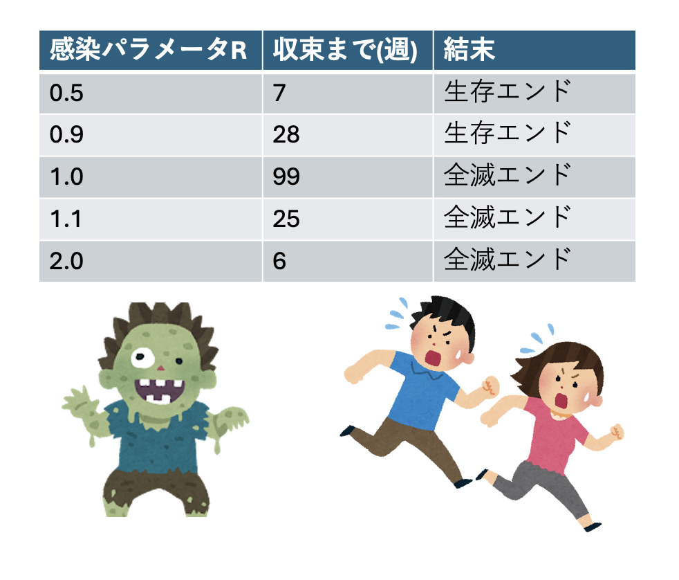
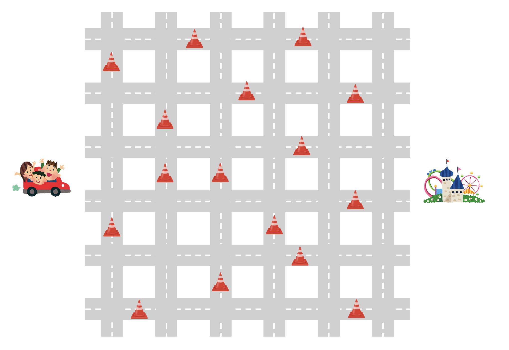
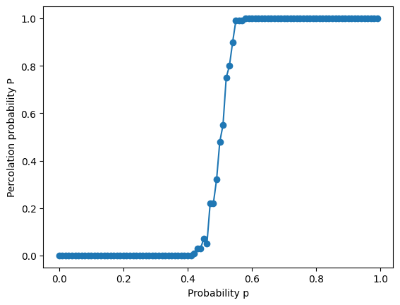
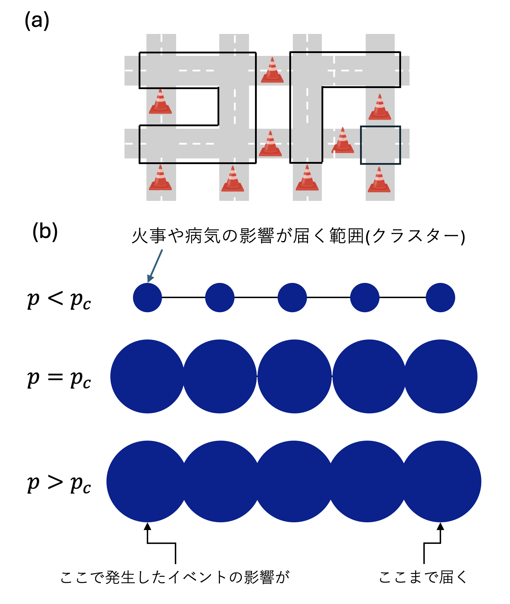

# 風邪はなぜ流行る？　～相転移の不思議～

## はじめに

2020年ごろ、新型コロナウイルス感染症が世界中で流行しました。日本でも緊急事態宣言が出され、大学や学校が休校になったり、授業がオンラインに切り替わったりしました。外出を控えることや、人との接触を減らすことが求められた時期を覚えている人もいるかもしれません。

このとき重要だったのは、「感染はどのように広がるのか」「人との接触をどのくらい減らせば、流行を抑えられるのか」を予測することでした。感染の広がりは、実際に社会全体で試してみるわけにはいきません。そこで使われたのが、数値シミュレーションです。

本章では、「病気が人から人へうつる」とはどういうことか、そして「流行する」とはどういうことかを、シミュレーションを通して考えてみましょう。

## ゾンビパニックモデル

あなたの町にゾンビが現れたとします。ゾンビは1週間で活動を停止しますが、その間に噛まれた人はゾンビになってしまいます。人がゾンビになってから活動を停止するまでに、平均で$R$人に噛みつき、新たなゾンビを生み出すとします。このパラメータ$R$を感染率と呼びましょう。

もともと1万人が住んでいた町で、最初に100人がゾンビになったとしましょう。このとき、ゾンビが全員活動を停止するまでに、どれくらいの被害が出るでしょうか。また、その被害は感染率$R$によってどのように変わるでしょうか。ここでは、小数点以下は切り捨てるものとして、このゾンビパニックモデルをシミュレーションしてみます。

```py
def zombie(r):
    N = 10000
    z = 100
    N = N - z
    z_total = 0
    weeks = 0
    for i in range(1000):
        weeks += 1
        z_total += z
        z = int(z*r)
        N = N - z
        if N < 0:
            N = 0
        if z == 0 or N == 0:
            break
    return N, weeks

for R in [0.5, 0.9, 1.0, 1.1, 2.0]:
    N, weeks = zombie(R)
    if N >0:
        result = "生存エンド"
    else:
        result = "全滅エンド"
    print(f"R= {R}, 生存者 {N:4d}人, 収束まで {weeks:2d}週, {result}")
```

最初に、$R=0.1$の場合を考えてみましょう。これは、10体のゾンビが活動を停止するまでに、平均して1人だけが被害にあうという状況です。最初に100体のゾンビがいるので、最初の1週間で10人が新たにゾンビになり、最初にいた100体のゾンビは活動を停止します。次の週には、10体のゾンビが1人をゾンビにして活動を停止します。最後に残った1体のゾンビは、誰もゾンビにすることなく活動を停止します。したがって、ゾンビパニックは3週目には収束します。最初のゾンビも含めて、ゾンビになった人は合計111人で、生存者は9789人になります。

次に、$R=0.5$の場合を考えます。これは、2体のゾンビに対して1人の被害者が出るような状況です。最初に100体のゾンビがいるので、次の週には50人が新たにゾンビになります。その次の週には25人がゾンビになり、さらにその次は12人、というように、被害者の数はだんだん半分になっていきます。最終的に、すべてのゾンビが活動を停止するのは7週目で、それまでに197人が被害にあうことになります。

$R=0.9$の場合は、さらに収束までに時間がかかります。1体のゾンビが生み出す新たなゾンビの数は1体未満なので、最終的には流行は止まります。しかし、減り方がゆっくりになるため、事態が収束するまでに28週かかります。このとき、被害者は863人で、生存者は9037人となります。

ここまでは、ゾンビがすべて活動を停止したあとに生存者が残る、いわゆる「生存エンド」でした。しかし、感染率$R$が1になった瞬間、状況は大きく変わります。

$R=1$の場合、100体のゾンビは100人をゾンビにしてから活動を停止します。次の週も、活動中のゾンビは100体いて、その100体がまた100人をゾンビにします。つまり、活動中のゾンビの数が減りません。そのため、ゾンビパニックは全員がゾンビになるまで終わりません。最終的に99週後には生存者がゼロになり、全滅エンドを迎えます。

さらに、感染率$R$が1より大きい場合、活動中のゾンビの数はどんどん増えていきます。そのため、必ず全滅エンドになります。たとえば、$R=1.1$の場合を考えてみましょう。最初は100体だったゾンビが、次の週には110体になります。その次は121体、さらにその次は133体、146体というように、活動中のゾンビの数が次第に増えていきます。最終的には25週目に生存者がゼロとなり、全滅エンドを迎えます。$R=2.0$の場合は、状況はさらに急速に悪化します。活動中のゾンビの数は200体、400体というように倍々に増えていき、6週目には全滅してしまいます。



以上の状況をまとめると、感染率$R$が1より小さいときには生存エンド、1より大きいときには全滅エンドになります。ただし、感染率がちょうど1の場合と1より大きい場合は、どちらも全滅エンドではありますが、その性質は異なります。$R<1$のとき、活動中のゾンビの数はだんだん減っていきます。たとえば$R=0.5$なら、ゾンビの数は毎週およそ半分になっていきます。このように、一定の割合で減っていく変化を指数関数的な減少と呼びます。一方、$R>1$のとき、活動中のゾンビの数はだんだん増えていきます。たとえば$R=2$なら、ゾンビの数は毎週およそ2倍になっていきます。このように、一定の割合で増えていく変化を指数関数的な増加と呼びます。そして、$R$がちょうど1のときには、ゾンビの数は増えも減りもしません。活動中のゾンビの数はほぼ一定のままですが、そのゾンビたちが毎週新たな人をゾンビにしていくため、生存者は時間に比例して減っていきます。このように、あるパラメータに特別な境目があり、その境目をまたぐと状況が大きく変わることがあります。このような現象を**相転移**と呼びます。また、その境目となる値を**相転移点**と呼びます。

相転移とは、小さな部分では同じルールに従って動いているにもかかわらず、パラメータが少し変わるだけで、全体の性質が大きく変わる現象です。ゾンビパニックモデルでは、$R=1$が相転移点です。感染率$R$が$1$よりわずかでも小さければ生存エンド、わずかでも大きければ全滅エンドと、ほんの少しの違いで未来が大きく変わってしまいます。

また、相転移である$R=1$では、収束までの時間が最も長くかかっています。このように、相転移点近傍では様々なダイナミクスが遅くなることがあります。

## 都市の横断モデル



図：碁盤の目状の道路が走る都市がある。道がところどころ通行止めになっている。無事な道だけを通ってこの都市を横断できるか？

ゾンビパニック問題の例では、少し考えれば「$R=1$ を境に性質が大きく変わりそうだ」と予想できるかもしれません。では、次にもう少し結果を予想しにくい例を考えてみましょう。道路が碁盤の目のように並んでいる都市を考えます。たとえば札幌のような、東西南北に道路が整然と並んだ都市を想像するとよいでしょう。この都市を車で左から右へ横断したいとします。ところが、大雪が降ったために、道路の一部が通行止めになってしまいました。このとき、通行できる道路だけを通って、都市の左端から右端までたどり着ける確率を考えます。この確率を、ここでは**横断可能確率**と呼ぶことにします。

いま、$L \times L$ の碁盤の目状の道路を考えます。それぞれの道路は、ある確率で通行可能であり、残りは通行止めになっているとします。通行可能な道路の割合、つまり**通行可能確率**を $p$ とします。ここで、$p=0$ ならすべての道路が通行止め、$p=1$ ならすべての道路が通行可能であることを表します。このとき、横断可能確率 $P(p)$を、通行可能確率 $p$の関数として求めることを考えます。

たとえば、通行可能確率が $p=0.5$、つまり50%の場合を考えてみましょう。それぞれの道路についてコインを投げ、表なら通行可能、裏なら通行止めとします。すべての道路について通行可能か通行止めかを決めたあと、通行可能な道路だけを使って、都市の左端から右端まで行けるかどうかを調べます。もちろん、1回だけ試しても、それが典型的な結果とは限りません。そこで、同じ $p$ の値に対してこの実験を何度もくり返します。たとえば100回くり返して、そのうち25回で左から右へ横断できたなら、横断可能確率 $P(p)$は約25%であると考えます。このようにして、さまざまな$p$の値に対して横断可能確率$P(p)$を調べます。このモデルを、ここでは**都市の横断モデル**と呼ぶことにします。

すぐにわかることもあります。すべての道路が通行止め、つまり$p=0$の場合には、絶対に横断できません。したがって、横断可能確率は $P(0)=0$です。一方、すべての道路が通行可能、つまり$p=1$の場合には、必ず横断できます。したがって、横断可能確率は$P(1)=1$です。また、$p$ が大きくなるほど、通行可能な道路が増えるので、横断しやすくなるはずです。そのため、横断可能確率$P(p)$も大きくなっていくだろうと予想できます。では、$0 < p < 1$の間では、どのような変化が起きるのでしょうか。通行可能な道路が少しずつ増えるにつれて、横断可能確率もなめらかに少しずつ増えていくのでしょうか。それとも、ある値を境にして、急に横断できるようになるのでしょうか。シミュレーションしてみましょう。都市横断モデルをシミュレーションするためには、道をランダムに通行止めにした後、その状態で「どの場所とどの場所が通行可能であるか」を調べる必要があります。そのためにはUnion-Findアルゴリズムという手法が必要です。ここでは詳細は説明しませんが、Union-Findアルゴリズムは「AとBが友達、BとCが友達ならば、AとCも友達」というように、つながりを判定するためのアルゴリズムです。

```py
import random
from matplotlib import pyplot as plt

def find(i, parent):
    while i != parent[i]:
        i = parent[i]
    return i

def union(i, j, parent):
    i = find(i, parent)
    j = find(j, parent)
    parent[j] = i

def make_conf(L, p):
    parent = [i for i in range(L * L)]
    for iy in range(L-1):
        for ix in range(L-1):
            i = ix + iy * L
            j = ix+1 + iy * L
            if random.random() < p:
                union(i, j, parent)
            j = ix + (iy+1) * L
            if random.random() < p:
                union(i, j, parent)
    return parent

def check_percolated(L, p):
    N = L**2
    parent = make_conf(L, p)
    for i in range(L):
        for j in range(N-L-1, N-1):
            if find(i, parent) == find(j, parent):
                return True
    return False

random.seed(1)
trial = 100
L = 32
p_values = []
percolation_probabilities = []
for i in range(100):
    p = i/100.0
    count = 0
    for j in range(trial):
        if check_percolated(L, p):
            count += 1
    P = count / trial
    p_values.append(p)
    percolation_probabilities.append(P)
plt.plot(p_values, percolation_probabilities, marker='o')
plt.xlabel("Probability p")
plt.ylabel("Percolation probability P")
plt.show()
```

プログラムを実行して得られた「道路の通行可能確率$p$に対する都市の横断確率$P$の図」がこちらです。



図：$32 \times 32$の碁盤の目状の都市において、確率$p$で道路が通行可能である時、都市を横断できる確率$P$の$p$依存性。$p=0.5$を境に確率$P$が大きく変化している。

道の通行可能確率が50%、つまり$p=0.5$に達するまでは、横断可能確率$P$はほとんどゼロです。つまり、都市を左から右へ横断することはほとんどできません。一方、$p=0.5$を超えたあたりで、横断可能確率 $P$は急激に大きくなり、いきなりほぼ100%に達します。つまり、この都市は、道の通行可能確率がある「しきい値」に達する前と後で、大きく性質が変わります。たとえば、通行可能確率が50%よりわずかに小さい場合、この都市はほとんど横断できません。一方、道の通行確率が50%を少しでも超えると、ほぼ確実に横断できるようになります。わずかな確率の違いが、「横断できない都市」と「横断できる都市」という大きな違いを生み出します。実は、これも水の沸騰や氷への変化と同じく、相転移現象の一種です。特に、このような現象を**パーコレーション転移**と呼びます。

パーコレーションとは、「浸透」という意味です。コーヒーが好きな人なら、パーコレーターという器具を知っているかもしれません。パーコレーターという名前は、英語のpercolateという言葉に由来しています。これは、「液体が何かの中をゆっくり染みていく」「液体が濾過される」といった意味を持つ言葉です。パーコレーション転移とは、たとえば左から水を流したときに、水が途中で止まってしまう状態から、水が通れる道をたどって右側まで染み出していく状態へ変わる相転移のことです。前者を非パーコレーション相、後者をパーコレート相と呼ぶことがあります。

では、なぜほんの少しのパラメータの変化で、このように大きな変化が起きるのでしょうか。それを調べるために、道路のつながり方に注目してみましょう。

まず、ある交差点から通行可能な道だけを通って別の交差点に行けるとき、これらの交差点は同じグループに属していると考えます。たとえば、交差点Aから交差点Bに行くことができ、さらに交差点Bから交差点Cに行くことができるなら、交差点A、B、Cはすべて同じグループです。いわば、「友達の友達は友達」という考え方です。

道の通行可能確率が非常に小さいとき、それぞれの交差点から行ける場所はほとんどありません。せいぜい隣の交差点に行けるかどうかで、多くの交差点は他の交差点とつながらず、孤立した状態になります。

しかし、通行可能確率が大きくなるにつれて、通れる道が増えていきます。すると、隣の交差点とつながり、さらにその先の交差点ともつながるようになります。小さなグループどうしが少しずつ結びつき、だんだん大きなグループができていきます。通行可能確率が50%に近づいてくると、都市のあちこちに大きなグループが現れます。そして、それらのグループがあと少しでつながりそうな状態になります。さらに通行可能確率が50%を超えたあたりで、それまで別々だったグループが一気につながり、都市全体を横切るような巨大なグループが生まれます。この巨大なグループが左端から右端までつながっていれば、都市を横断することができます。つまり、都市が横断可能かどうかは、都市の端から端まで届くような大きなグループができているかどうかで判断できます。



図：クラスターの定義。(a) 通行可能な道路を通じて相互に行き来可能な場所を「同じクラスターに属す」と定義する。(b) 確率$p$が大きくなるほどクラスターは大きくなる。臨界点$p_c$においてクラスターはギリギリ接するかどうかとなり、臨界点を超えると全てのクラスターがつながって、どこかで起きた影響が世界全体に広がる。

この「友達グループ」のことを、**クラスター**と呼びます。特に、都市全体に届くほど大きく成長したクラスターのことを、**パーコレーションクラスター**と呼びます。クラスターは、「現在の影響が及ぶ範囲」を表していると考えることができます。先ほどの都市横断の例では、クラスターは「通行可能な道だけを使って行ける範囲」を表していました。もしそのクラスターが都市の左端から右端までつながっていれば、都市を横断できます。

パーコレーションは、道路の問題だけでなく、別の現象を表すモデルとしても使えます。たとえば、山火事を考えてみましょう。山に木がたくさん生えているとします。ある木が燃えたとき、隣の木に燃え移る確率を$p$とします。山が乾燥していたり、木が密集していたりするほど、$p$ の値は大きくなります。最初に1本の木が燃えると、火は確率$p$で隣の木に燃え移ります。さらに、その木からまた別の木へと燃え広がっていきます。そして、燃え移れる木がなくなったところで火は止まります。このとき、実際に燃えた木のグループがクラスターです。

燃え移る確率$p$が小さい場合、クラスターは小さくなります。どこから燃え始めても、火はすぐに止まり、ボヤで済みます。$p$が少しずつ大きくなっても、しばらくはクラスターの大きさはそれほど変わりません。しかし、ある転移点を超えた瞬間に、山全体に届くような巨大なクラスターが現れます。つまり、パーコレーションクラスターが発生し、山全体が火事になってしまうのです。

パーコレーションは、病気の感染モデルとして考えることもできます。ある地域で、誰かが風邪をひいたとします。その人から隣の家の人に風邪がうつる確率を$p$とします。もし隣の家の人が風邪をひいたら、その人からさらに別の家の人に、同じように確率$p$で感染するかもしれません。こうして感染が次々と広がっていきます。そして、最終的に病気が広がらなくなったとき、感染した人たちのグループがクラスターです。新型コロナウイルス感染症が流行した際、ニュースなどで「クラスター発生」という言葉をよく聞いた人もいるでしょう。この場合のクラスターは、「ある特定の場所や集団で発生した集団感染」を表しています。感染確率が低いときには、クラスターのサイズは小さくなります。感染者が出ても、周囲の少数に広がるだけで、やがておさまります。感染確率が少しずつ大きくなっても、しばらくは大きな流行にはならないかもしれません。しかし、あるしきい値を超えた瞬間に、パーコレーションクラスターが発生します。つまり、感染が地域全体、場合によっては世界全体へ広がるような大流行につながってしまいます。

ここで怖いのは、ほんの少しのパラメータの変化が、非常に大きな結果の違いを生むことです。ゾンビパニックモデルでも、平均して何人をゾンビにするかを表す$R$が$1$を超えるかどうかで、「生存エンド」と「全滅エンド」が分かれました。パーコレーションでも同じように、パラメータ$p$がしきい値を少し下回るか、少し上回るかによって、結果が大きく変わります。例えば火事なら、ボヤで済むか、山全体に燃え広がるか、感染症なら、小さな集団感染で終わるか、社会全体に広がる大流行になるかが変わります。だからこそ、「まだたいしたことはない」と思える段階で、しっかり対策することが重要です。しきい値を超えてからでは、現象は一気に広がってしまうかもしれません。数値シミュレーションは、そのような危険な境目がどこにあるのか、そして小さな条件の違いがどれほど大きな結果につながるのかを調べるための重要な道具なのです。

## まとめ

本章ではゾンビパニックモデル、都市の横断モデル、格子気体デルという「何かがどこかに影響を及ぼしていく」現象をモデル化して扱いました。ゾンビパニックモデルには「平均噛みつき人数」、都市の横断モデルには「道の通過可能確率」、格子気体モデルには「温度」というパラメーターがあり、それぞれ「しきい値」を超えるか超えないかで結果が大きく変わります。ゾンビパニック問題ではしきい値は簡単に予想できましたが、都市の横断モデルではそのしきい値を予想することも、そもそもそのようなしきい値が存在することを予想することも難しかったはずです。格子気体モデルでは、非常に単純なモデルであるにも関わらず、本物の水と本質的に同じ相転移を引き起こします。これも「すべてのルールは既知、しかしその結果は未知」というシミュレーションの面白さを表しています。

ゾンビパニック問題と都市の横断問題は「パーコレーション転移」と呼ばれる相転移の一種です。パーコレーションは山火事や病気の感染など「何かが次々と隣に影響を及ぼしていく時、その影響が局所的におさまるか、全体に広がるか」を記述するモデルです。ゾンビパニック問題では「どのゾンビとどの人が近い」とか「遠い」という情報を一切考慮しない、すなわち「空間」を全く考えていませんでした。一方で、都市の横断モデルでは、「ある交差点から到達可能な広がり」を考えました。これをクラスターと呼び、影響が空間的に広がる範囲を表しています。パラメーターがしきい値より小さい時にはクラスターも小さく、パラメータが増えても少しずつしか大きくなりませんが、ある「しきい値」を超えた瞬間にクラスターはお互いにくっついて世界規模の大きさに急激に成長します。一般の人にとっては「まだそんなにひどいことにはなっていないな」と思っている場合にも、感染の専門家が必死になって「パラメーター」を下げようとする背景には、このように感染系の現象は相転移的な振る舞いを示し、少しのパラメータの変化で甚大な被害をもたらす可能性があるからです。
