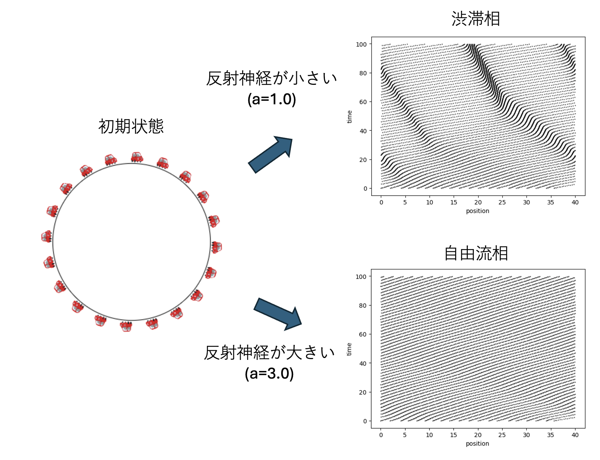
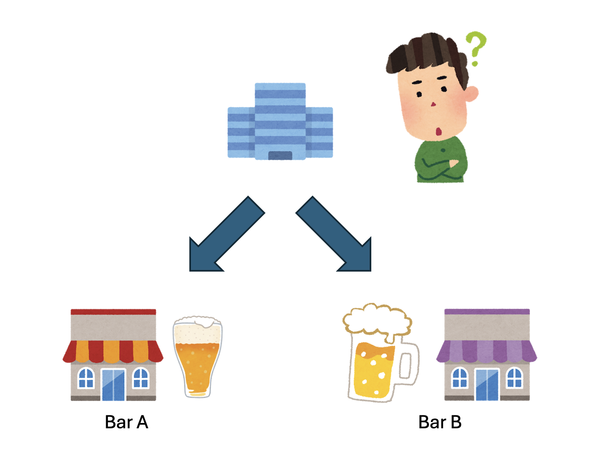
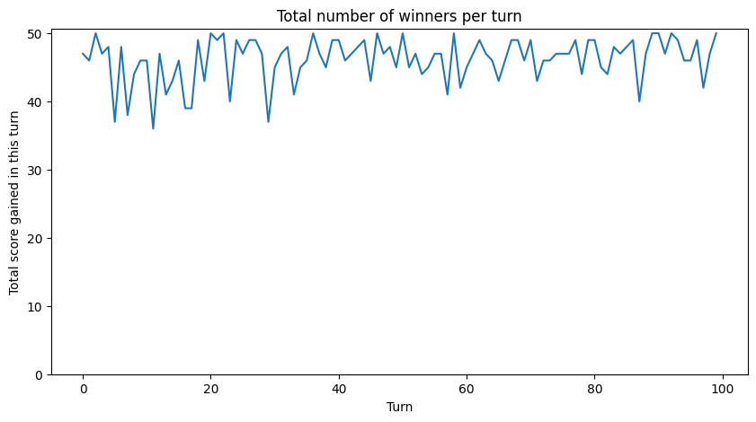

# 渋滞はなぜ起きる？　～社会のシミュレーション～

## はじめに

これまで、様々なシミュレーションを実施してきました。リボ払いや、ガチャの確率など、身近ではあるけれど、なんとなく対象が小さかったですね。もっと、社会全体をシミュレーションしたりできないでしょうか？本章では、人間社会で起きるような現象をシミュレーションしてみましょう。

## 渋滞のシミュレーション

ゴールデンウィークに家族で車に乗って行楽地に行く時、ひどい渋滞に巻き込まれてうんざりした経験があるでしょう。渋滞は、よく上り坂やトンネル、合流など、速度が落ちるところで発生すると言われています。では、そのような「きっかけ」が全く無いような世界では渋滞は起きないのでしょうか？シミュレーションで確かめてみましょう。


図：最適速度モデル。(a) 各車は、前の車との車間距離に応じて「目標とする速度(最適速度)」を決める。(b) 最適速度の車間距離依存性。車間距離が0なら速度0、車間距離が十分に大きければ法定速度に漸近するような関数を採用する。

シミュレーションをするためには、車がどのように走るかをモデル化する必要があります。車を運転する時、基本的に前だけを見て、後ろはあまり気にしません。前を走る車が目の前にいる時には速度をゼロにして、車が前方に見えなければ自分が走りたい最高速度で走るとして、その間の「ちょうど良い速度」は車間距離で決まると思われます。前方の車との車間距離がゼロなら自分の目標速度はゼロ、車間距離が十分長ければ自分の好きな速度で走ることにして、車間距離がその間なら中ぐらいの速度を目標とします。この、車間距離から決まる適切な速度を、その車にとっての**最適速度**と呼ぶことにしましょう。

また、車間距離が変わったのを見てからブレーキやアクセルを踏むのに少しタイムラグがあると思われます。反射神経が早ければ早いほど、すぐに自分の車を目標速度に制御できるでしょう。

この振る舞いをモデルに落としてみましょう。車が$N$台あり、それが円周状のサーキットに同じ向きに配置されているとします。車に背番号をつけ、進行方向に番号を増やすことにします。

番号$i$の車の位置を$x_i$で表します。この車の前を走る車は$i+1$番ですから、$i$番の車が感じる車間距離$\Delta x_i$は$x_{i+1} - x_i$です。この車にとっての最適速度を$V(\Delta x_i)$と表現します。$V(x)$は、車間距離を入れると最適速度を返す関数です。現在の速度を$v_i$とすると、最適速度との差は$V(\Delta x_i) - v_i$となります。ドライバーはこの差を小さくしようと運転するものとしましょう。以上のモデルについて、車が従うべき式は以下のように表すことができます。

$$
\frac{d v_i}{d t} = a \left(V(\Delta x_i) - v_i \right)
$$

これは、連立微分方程式と呼ばれる方程式です。左辺の$d v_i/dt$は、車$i$の速度の変化分で、アクセルを踏めば正、ブレーキを踏めば負になります。アクセルを踏むべきかブレーキを踏むべきかは、現在の車間距離から決まる最適速度$V(\Delta x_i)$と、現在の速度$v_i$の差で決まります。現在の速度が最適速度よりも遅ければ右辺は正、つまりアクセルを踏むことになります。逆ならブレーキです。比例係数$a$は、「どれくらい強くアクセルもしくはブレーキを踏むか」というパラメータで、ドライバーの反射神経を表しています。車の振る舞いをこの式で表すモデルを**最適速度モデル**と呼びます。

このモデルに従う車を円形のサーキットにたくさん配置してから動かして、しばらく放っておきましょう。シミュレーションコードは以下のようになります。

```py
from math import tanh
from matplotlib import pyplot as plt
import numpy as np

def V(dx):
    return tanh(dx -2.0) + tanh(2.0)

def init(L, number_of_cars, car_positions, car_velocities):
    dx = L / number_of_cars
    x = 0.0
    iv = V(dx)
    for i in range(number_of_cars):
        car_positions[i] = x
        car_velocities[i] = iv
        x += dx
        x += np.random.uniform(-0.5, 0.5)

def step(L, number_of_cars, car_positions, car_velocities, a, dt):
    for i in range(number_of_cars):
        dx = car_positions[(i + 1) % number_of_cars] - car_positions[i]
        if (dx < 0.0):
            dx += L
        car_velocities[i] += a * (V(dx) - car_velocities[i])*dt
        car_positions[i] += car_velocities[i]*dt
        if (car_positions[i] > L):
            car_positions[i] -= L

def run(a):
    T = 50000
    L = 40
    number_of_cars = 20
    dt = 0.002
    car_positions = np.zeros(number_of_cars)
    car_velocities = np.zeros(number_of_cars)
    init(L, number_of_cars, car_positions, car_velocities)
    history = []
    times = []
    data_x = []
    data_y = []
    for i in range(T):
        step(L, number_of_cars, car_positions, car_velocities, a, dt)
        if (i%100==0):
            data_x += car_positions.tolist()
            data_y += [i*dt]*number_of_cars
    plt.xlabel("position")
    plt.ylabel("time")
    plt.scatter(data_x, data_y, s=1.0, alpha=0.5,color="black")
    plt.show()

a = 1.0 # 反射神経パラメータ (a=1.0で渋滞相、a=3.0で自由流相)
np.random.seed(1)
run(a)
```

このコードが出力するのは、全ての車の位置を時間に対してプロットしたもので、**時空図**と呼ばれています。以下の図は、反射神経パラメータ$a$を変えてシミュレーションした結果です。



図2: 最適速度模型のシミュレーション。最初にサーキットに車を等間隔に配置し、一斉に運転を始める。車間距離が十分に空いていたり、ドライバーの反射神経が良いと渋滞は発生しない(自由流相)が、車間距離が狭くなると渋滞が発生する(渋滞相)。

ドライバーの反射神経パラメータが大きい場合$(a = 3.0)$には何も起きず、全ての車がそのまま同じ速度かつ等間隔に並んで走るだけなので、時空図は一様な縞模様になります。どこかの車がブレーキを踏んでも、車はお互いの車間距離をなるべく空けようとするので、しばらくすると等間隔に戻ります。車が自由に流れているので、この状態を**自由流相**と呼びます。

一方、ドライバーの反射神経パラメータが小さい場合$(a = 1.0)$には、時空図に濃い縞模様が現れます。これが渋滞です。車の密度に対して反射神経パラメータがある程度小さい場合、「どこかの車が少しでもブレーキを踏むと、後続の車が次々とブレーキを踏み・・・」と、ドライバーの反応の遅れが後続の車に伝搬し、ついにはほとんど止まってしまう」という状態になります。こちらは**渋滞相**と呼ばれます。


もともと、円形のサーキットに車を並べただけですから、ここには坂もトンネルもありません。にも関わらず、車の数が増えたら渋滞が発生してしまいました。これにより、渋滞とは、道路にある程度以上の車がいたら自然に発生するのではないかと推測ができます。渋滞が発生する条件を満たしている時に坂やトンネルがあるとそこから渋滞が発生しますが、そのような「きっかけ」がなくても渋滞は発生する可能性があります。

また、二種類の状態を「自由流相」「渋滞相」と呼ぶことからわかるように、これらの状態の変化は一種の相転移であるとみなすことができます。水が沸騰したり凍ったりするような現象と、車が渋滞を引き起こす現象、全く異なるように見える現象を、同じ「相転移」という考え方で理解することができます。

このモデルでは、反射神経パラメータ$a$と車の数(正確には平均車間距離)によって、渋滞が起きるかどうかが決まります。こんな簡単なモデルで、渋滞の発生という、実際に社会で起きる現象を再現することができました。

## 空いている店を選べ！



アメリカのとある研究所では、付近にバーが2軒しかありませんでした。どちらも研究所から結構遠くにあり、仕事終わりに研究者はどちらかのバーに行きます。静かに飲みたいので、混んでいる方に行きたくありません。しかし、どちらが混んでいるかは行ってみないとわかりません。研究者たちは、仕事終わりにどちらのバーに行くか決めます。そして、行った先が空いていたら「勝ち」、混んでいたら「負け」としましょう。これは、少数派(マイノリティ)に入れば勝ちとなるゲームなので、マイノリティ・ゲームと呼ばれています。

このゲームをモデル化しましょう。このゲームの参加者をプレイヤーと呼ぶことにします。各プレイヤーは、他のプレイヤーにわからないように毎回「A」か「B」のどちらかの札を選択します。全員が選択を終えたら集計し、AとBの札の少なかった方を選んだプレイヤーに、それぞれ1点が入ります。これを1ターンとして、ターンを十分繰り返すことにします。プレイヤーに開示されるのは、毎ターン「どちらの札がマイノリティであったか」だけです。そこで、プレイヤーはこれまでの「マイノリティであった札の履歴」から、次にどちらを選べばマイノリティ側になれるかを予想して、札を選ぶことになります。

さて、プレイヤーは「A, B, A, A, A」のような履歴を見て、次に自分がどちらを選ぶか決めなくてはいけません。


以下がそのコードです。

```py
import numpy as np
import matplotlib.pyplot as plt

def history_to_index(history):
    index = 0
    for bit in history:
        index = 2 * index + bit
    return index

def choose_strategies(strategy_scores, N):
    chosen = []
    for i in range(N):
        max_score = np.max(strategy_scores[i])
        candidates = np.where(strategy_scores[i] == max_score)[0]
        chosen.append(np.random.choice(candidates))
    return chosen

def run_minority_game(N, T, L, S):
    history_length=L
    num_strategies_per_player=S
    num_histories = 2 ** history_length
    strategies = np.random.randint(0, 2,size=(N, num_strategies_per_player, num_histories))
    strategy_scores = np.zeros((N, num_strategies_per_player),dtype=int)
    history = list(np.random.randint(0, 2, size=history_length))
    total_score_per_turn = []
    for t in range(T):
        h_index = history_to_index(history)
        chosen_strategies = choose_strategies(strategy_scores, N)
        choices = np.empty(N, dtype=int)
        for i in range(N):
            s = chosen_strategies[i]
            choices[i] = strategies[i, s, h_index]

        num_A = np.sum(choices == 0)
        num_B = np.sum(choices == 1)
        if num_A < num_B:
            minority_choice = 0
        else:
            minority_choice = 1
        winners = choices == minority_choice
        total_score_per_turn.append(np.sum(winners))
        for i in range(N):
            for s in range(num_strategies_per_player):
                prediction = strategies[i, s, h_index]
                if prediction == minority_choice:
                    strategy_scores[i, s] += 1

        history.pop(0)
        history.append(minority_choice)
    return total_score_per_turn


np.random.seed(1)
N = 101 # プレイヤー数
T = 100 # 総ターン数
L = 5   # 履歴をどれくらい見るか
S = 2   # プレイヤーに配る戦略数 
total_score_per_turn = run_minority_game(N, T, L, S)
# 時間発展をプロット
plt.figure(figsize=(10, 5))
plt.plot(total_score_per_turn)
plt.ylim(bottom=0)
plt.xlabel("Turn")
plt.ylabel("Total score gained in this turn")
plt.title("Total number of winners per turn")
plt.show()
```

実際に、101人、履歴を5つまで参照し、戦略表を各プレイヤーに2枚ずつ配った場合の結果を以下に示します。



各ターンで、プレイヤーが得た得点の合計、つまり「マイノリティ」を選んだプレイヤーの数が表示されています。これを見ると、得点は揺らいでいるものの、概ね50点に近い値になっていることがわかります。これは、多くのターンにおいてプレイヤーがほぼ半々に分かれたことを意味しています。マイノリティ・ゲームは、「マイノリティ」に入った人だけが得点をもらえます。ここで、マイノリティが何人であろうと、マイノリティに入った人の得る得点は変わりません。例えばAを選んだ人が1人で、Bを100人が選んだとすると、バーAはガラガラです。一方、Aを選んだ人が50人、Bを選んだ人が51人だとすると、AもBもたいして状況が変わりません。それでもAを選んだ50人全員に得点がもらえます。マイノリティ・ゲームの参加者が101人の場合、得点を貰える、つまりマイノリティになれるのは最大50人です。各プレイヤーは他のプレイヤーと情報を交換しておらず、自分に配られた戦略表の過去の成績だけを元に、自分の利益を最大化するように行動しています。にも関わらず、50人に近い人が「マイノリティ」に入っているのを見ると、「なるべく多くの人が得点を取れるように行動しましょう」という紳士協定のようなものが結ばれているかのようです。

このように、個々のプレイヤーが自分の利益だけを考えて行動しているにも関わらず、全体としては多くのプレイヤーが得点を得られる状態が実現することがあります。このような振る舞いを**協調現象**と呼びます。マイノリティ・ゲームでは、個々のプレイヤーが単純な規則に従って利己的に行動しているだけでも、集団全体としては効率のよい状態が生まれることがあります。この点が、マイノリティ・ゲームが市場や交通、資源配分などのモデルとして興味深い理由です。各参加者が局所的な情報のみを参照しているにも関わらず、適応の結果としてあたかも全体が調整されているかのような振る舞いが現れることがあります。マイノリティ・ゲームは、市場などにおける人々の競争的な意思決定を、非常に単純化して表したモデルの一つです。

## まとめ

渋滞を引き起こすモデルとして最適速度モデルを、人が混雑を避ける振る舞いを表すモデルとしてマイノリティ・ゲームを紹介しました。渋滞は身近な現象でありながら、多数の要素が相互作用する複雑な現象でもあります。円形のサーキットで自然に渋滞が発生するという実験は、渋滞が道路構造だけでなく、車の密度と相互作用そのものから生まれることを示しています。渋滞を相転移と捉えることで、私たちは日常的な交通現象を、物理学の考え方を使って理解することができます。マイノリティ・ゲームでは、簡単なゲームのプレイヤーの行動をモデル化することで、利己的に行動するプレイヤーが全体として協調しているかのような振る舞いが見られることがわかります。渋滞や市場など、人間の意思決定が関わるような複雑な現象でも、適切にモデル化することでその背後にある基本的な仕組みを調べることができます。

数値シミュレーションでは、モデルを作り、計算し、その結果を観察し、現実の現象や理論と比較します。そして、必要に応じてモデルを修正し、再び計算します。この過程を通じて、私たちは複雑な現象の中にある規則性や、集団として現れる新しい性質を発見することができます。渋滞や市場のように一見すると予測が難しい現象であっても、適切なモデル化によって、その発生条件や典型的な振る舞いを理解する手がかりを得ることができるのです。
